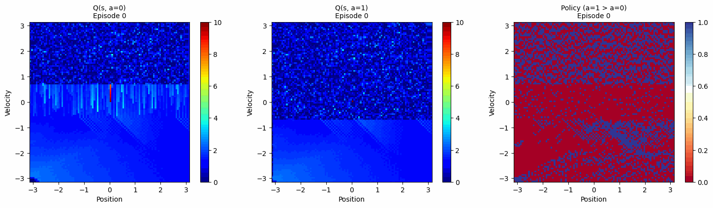

# RL Cart Control

两个强化学习算法控制小车系统：Q-Learning（离散）和 SAC（连续）。

## 技术栈

- Q-Learning: numpy, matplotlib
- SAC: PyTorch, numpy, matplotlib
- GIF生成: imageio, PIL

## Q-Learning

离散状态动作空间，Q值表迭代学习。状态空间100×100网格，动作{0,1}。

训练参数：α=0.99, γ=0.99, 120 episodes

**训练过程：**


Q值表演化：Q(s,a=0), Q(s,a=1), Policy

**轨迹：**


## SAC

连续控制，Actor-Critic架构。状态连续2D，动作[-1,1]。

网络：Actor 2→128→1, 双Critic 3→128→1

训练参数：lr=5e-4, γ=0.99, batch=64, 20 episodes

**轨迹：**


## 运行

```bash
python "rf learning qlearning8.18.py"
python saccart823.py
python create_gifs.py
```
