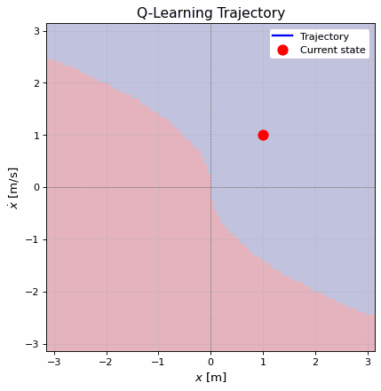
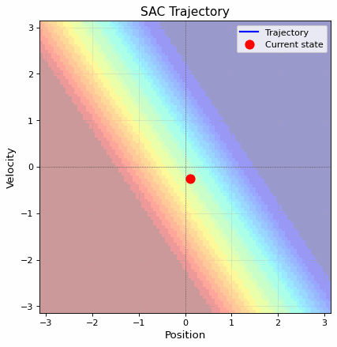

# RL Cart Control

Two reinforcement learning approaches for controlling a simple cart system: Q-Learning (discrete) and Soft Actor-Critic (SAC, continuous).

## Overview

This repository implements two reinforcement learning algorithms to solve a cart control problem. The goal is to control a one-dimensional cart system to stabilize at the origin (position and velocity near zero).

## Projects

### 1. Q-Learning (Discrete Control)

**File**: `rf learning qlearning8.18.py`

#### Introduction

Q-Learning is a model-free, value-based reinforcement learning algorithm that learns optimal actions through Q-value iteration. This implementation discretizes the continuous state space (position and velocity) into a grid and learns the optimal discrete action policy.

#### Method

- **Algorithm**: Q-Learning with discrete state-action space
- **State Space**: Discretized position and velocity grids (100×100)
- **Action Space**: Discrete actions {0, 1} corresponding to different force directions
- **Update Rule**: 
  ```
  Q(s, a) ← (1-α)Q(s, a) + α[r + γ·max(Q(s', a'))]
  ```
- **Parameters**:
  - Learning rate (α): 0.99
  - Discount factor (γ): 0.99
  - Episodes: 120

#### Results

The algorithm learns an optimal policy that guides the cart from arbitrary initial conditions to the origin. The Q-value maps and policy visualization show the learned control strategy.



### 2. Soft Actor-Critic (SAC) - Continuous Control

**File**: `saccart823.py`

#### Introduction

Soft Actor-Critic (SAC) is an off-policy, actor-critic deep reinforcement learning algorithm that maximizes both expected return and entropy, promoting exploration. This implementation uses continuous actions for more precise control.

#### Method

- **Algorithm**: Soft Actor-Critic (SAC) with continuous actions
- **State Space**: Continuous 2D (position, velocity)
- **Action Space**: Continuous action in [-1, 1] via tanh output
- **Networks**:
  - Actor: 2→128→1 (policy network)
  - Critic: 2×2 (twin Q-networks for stability)
- **Training**:
  - Twin Q-networks with target networks
  - Soft target updates (τ = 0.005)
  - Automatic temperature (entropy) tuning
- **Parameters**:
  - Learning rates: 5×10⁻⁴
  - Discount factor (γ): 0.99
  - Batch size: 64
  - Episodes: 20

#### Results

SAC learns a smooth, continuous control policy that efficiently stabilizes the cart at the origin. The policy and Q-value visualizations demonstrate the learned control strategy over the state space.



## Comparison

| Aspect | Q-Learning | SAC |
|--------|-----------|-----|
| Control Type | Discrete | Continuous |
| State Space | Discretized (100×100) | Continuous |
| Action Space | {0, 1} | [-1, 1] |
| Algorithm Type | Tabular | Deep RL |
| Exploration | ε-greedy (implicit) | Entropy-based |
| Convergence | Slower (tabular) | Faster (function approximation) |

## Requirements

- Python 3.x
- NumPy
- PyTorch
- Matplotlib
- imageio
- PIL (Pillow)
- tqdm (for Q-Learning)

## Usage

### Q-Learning
```bash
python "rf learning qlearning8.18.py"
```

### SAC
```bash
python saccart823.py
```

### Generate GIF Animations
```bash
python create_gifs.py
```

This will generate animated GIFs showing the trajectory of both algorithms.

## Results Visualization

The scripts generate visualizations of:
- Learned Q-value maps
- Policy visualization
- Training reward curves
- Trajectory plots (animated GIFs)

